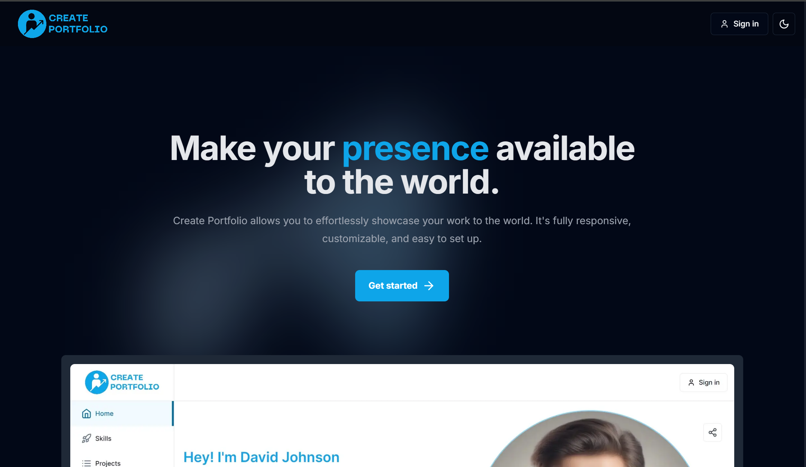

# Create Portfolio

Create Portfolio is a powerful, open-source platform designed to help you showcase your work effortlessly. It is free, fully responsive, customizable, and easy to set up. It's built with the latest technologies, including **Next.js 14**, **Tailwind CSS**, **ShadCN UI**, **TypeScript**, and **PostgreSQL** for data management. The platform is hosted on **Vercel** with caching and scaling powered by **Redis** and **AWS** for optimal performance. Here are some of its key features:

## Features

- **Customizable Portfolio**: Personalize your portfolio with custom branding options, including custom logos and favicons.
- **Custom Domain Support**: Premium users can host their portfolio on a custom domain with SSL included.
- **Live Analytics**: Monitor real-time statistics of your portfolio's engagement and traffic.
- **Dark Mode**: Enhance the user experience with light and dark mode options.
- **Fast & SEO-Friendly**: Powered by Next.js 14 with server-side rendering for lightning-fast load times and better SEO.
- **Server-Side Caching**: Experience a 50% boost in performance with premium server-side caching.
- **Accessible on All Devices**: The platform is fully responsive, ensuring your portfolio looks great on desktops, tablets, and smartphones.
- **Open-Source**: Contribute to the project on GitHub and customize it further to meet your needs.

## Quality and Best Practices

- **Modern Tech Stack**: Developed using the latest technologies like Next.js, TypeScript, and Tailwind CSS for scalability and reliability.
- **Secure & Scalable**: Integrations with Redis and AWS ensure the platform is both secure and scalable for large portfolios.
- **Optimized Performance**: Deployed on Vercel for quick server-side rendering, with PostgreSQL handling database operations.

## Premium Features

- **Custom Branding**: Add your personal touch with custom logos and branding options.
- **Custom Domain**: Get your own custom domain with SSL encryption.
- **Priority Support**: Get access to faster support and feature requests.
- **Dark Mode**: Provide better user experience by allowing your viewers to choose from dark and light mode.
- **Server Side Caching**: Experience 50% boost in page loading performance with our server-side caching, for optimal user experience.

## License

This project is licensed under the MIT License. See the [LICENSE](LICENSE) file for more details.

## Contact

For questions or feedback, reach out at [createportfolio.in@gmail.com](mailto:createportfolio.in@gmail.com).

---

Thank you for choosing Create Portfolio. We hope you enjoy building your online presence with our platform!